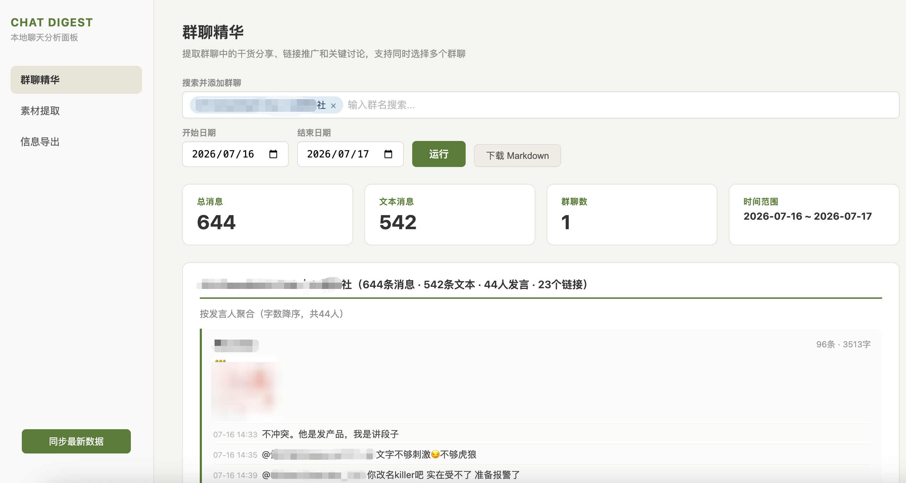
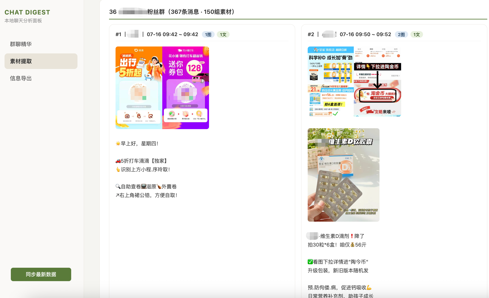
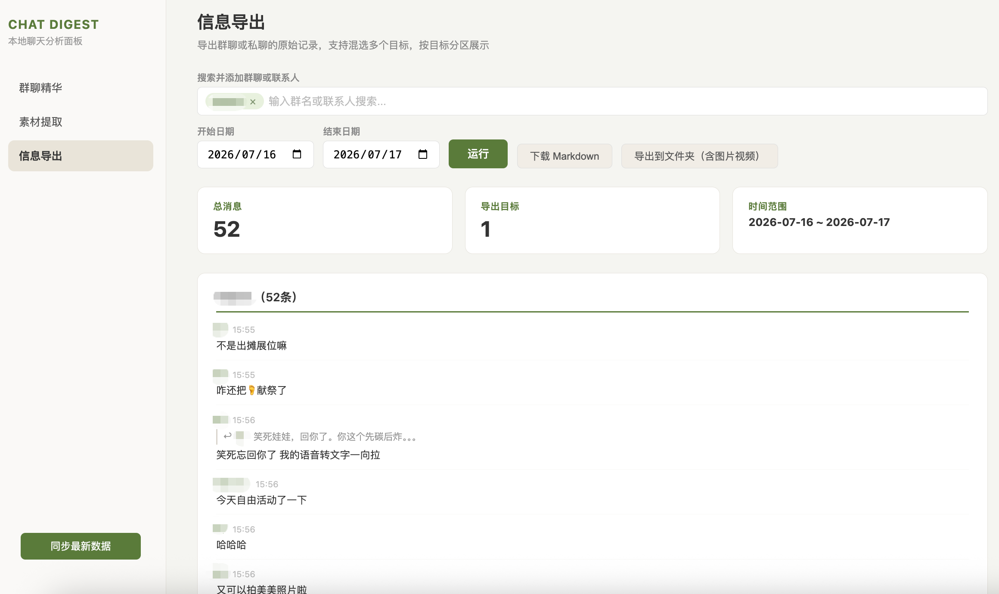
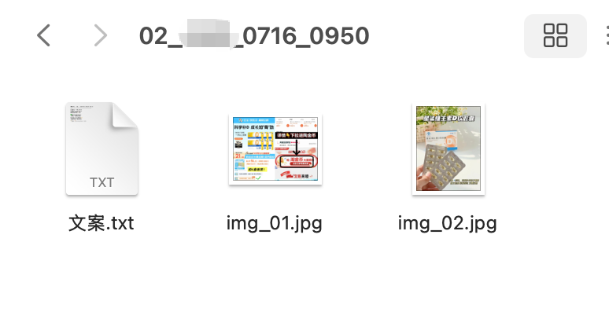

<p align="center">
  
</p>

<h1 align="center">v-local-chat · 本地聊天分析面板</h1>

<p align="center">
面向 <b>macOS 微信</b>（当前最新版实测可用）。把你自己的群聊和私聊，一键整理成<b>一眼能读的日报、干货精华、可导出的素材</b>。<br>
全程在你自己的电脑上跑，<b>不上传、不联网、不接任何第三方 API</b>。
</p>

<p align="center"><a href="README.en.md">English</a> · <a href="docs/01-获取密钥-指引.md">获取密钥指引</a> · <a href="docs/03-分析防踩坑.md">分析防踩坑</a></p>

---

## 三个场景，一眼看懂

<table>
<tr>
<td width="50%" valign="top"><b>群聊精华</b> —— 按发言人聚合、按贡献度排序，一眼看出谁在输出干货<br><br></td>
<td width="50%" valign="top"><b>素材提取</b> —— 图文 / 链接 / 文件 / 视频按时间分组，可导出<br><br></td>
</tr>
<tr>
<td width="50%" valign="top"><b>信息导出（对话备份）</b> —— 完整时间线、跨天日期分隔，可连图片视频导出成文件夹<br><br></td>
<td width="50%" valign="top"><b>导出结果</b> —— 图文一起落盘，不再是光秃秃的文字<br><br></td>
</tr>
</table>

---

## 它解决什么

群里一天几百条消息，大佬的干货、别人发的链接、有用的素材，全刷过去了，回头根本翻不到。私聊想留个上下文、复盘一段关系，也没趁手的工具。

它只做一件事并把它做到位：把原始聊天记录，重组成**人和大模型都好读**的形态。它不替你做 AI 分析——而是把消息整理成干净、带"谁回应谁"关系锚点的结构化文本，你再丢给 Claude / Codex / 任意大模型去总结，事半功倍。

两类人最用得上：想每天自动看群聊日报、一键沉淀大佬干货的你；以及做**私域 / 微商运营**、需要快速汇总上游群方法论与爆款素材的人。

## 凭什么比同类靠谱

同类工具大多**只吃老版本**——聊天软件一升级就集体失效（老方法靠内存里翻密钥，新版加了保护就翻不到了）。本项目走的是另一条更稳的路，**在当前最新版上实测跑通**。为什么别家在新版全线阵亡，作者写过一篇复盘：[《我把某聊天软件的加密系统拆了》](https://x.com/leaf_sanren/status/2073069608437764266)。

但"能解密"只是入场券。真正的价值在**拿到数据之后怎么用**，这一层是本项目的原创：

- **谁说了什么，绝不认错。** 发言人来自数据库事实，不靠大模型猜。哪怕是没加好友、连备注都没有的群成员，也能用"引用配对"反解出真名——别人只能显示一串乱码 id，我们能显示"张三"。
- **"谁在回应谁"，从猜变成事实。** 引用回复（回了谁的哪句原话）、@了谁，全部结构化提取。**这恰恰是大模型分析群聊时最容易张冠李戴、也最毁分析质量的地方**——我们把它钉成确定信息，A 夸 B 不会被读成 A 夸 C。
- **表情不再是乱码。** `[破涕为笑]` 自动还原成 😂（白名单精确匹配，绝不误伤营销文案、prompt 模板里的方括号）。
- **图片颜色是对的。** 我们啃下了微信图片解密里一个隐蔽的色差坑（否则整张图大面积偏色）；能解码的图颜色正常、可展示可导出，还如实标出哪些是本地无解的私有编码。
- **人看的和喂 AI 的，分开伺候。** 面板把回复渲染成低调的引用行给你看；给大模型的素材另带纯文本锚点——两种诉求各取所需，界面不乱、上下文不丢。

## 三步跑起来

> **最省心的方式：把这个仓库丢给你的命令行 Agent**（Claude Code / Codex / Grok build…），让它照着 [`docs/`](docs/) 帮你跑通。**全程你只需在两个点上亲手配合：输一次本机密码、扫码登录。** 其余复制软件、抓密钥、解密、起面板，Agent 都能代劳。

```bash
# 1) 获取密钥（一次性，指引见 docs/01-获取密钥-指引.md，本仓库不含抓取脚本）
#    这一步需要你配合 Agent 做几个动作，指引里写得很清楚，照着做即可。

# 2) 用密钥把聊天库解密成明文
python3 engine/decrypt_db.py --db-dir "<容器>/db_storage" \
    --keys ~/.config/wechat-keys.json \
    --out  "~/Library/Application Support/wechat-local-vault/decrypted/current"

# 3) 起面板（或直接双击 启动.command，会自动停掉旧实例再启动）
pip3 install flask pycryptodome zstandard
python3 panel/server.py            # 浏览器打开 http://127.0.0.1:5678
```

也可当 Claude Code Skill 用（见 `SKILL.md`）：让 AI 直接调 `engine/vault.py` 读取分析。

## 常见问题（QA）

**会不会封号？** —— 不会。核心操作都在你 Mac 本机完成，服务端监听不到。真正要避免的只有一件：别去自动化点软件界面、别高频操作，那才可能触发风控。正常准备一次密钥、之后纯本地只读，安全。

**会不会影响我的账号、导致登录 / 截图异常？** —— 不会。准备密钥时是对**复制到桌面的副本**操作，不动 `Applications` 里的原版，你怎么折腾都不影响日常在用的那个。

**Windows 能用吗？** —— 从技术逻辑判断不一定行。**macOS 一定可以**，4.1.9 及以上都验证过（当前最新 `4.1.11.55`）。

**图片一定能拿到高清吗？** —— 看你在软件里点开看过没：点开过 → 有高清（有时凌晨后台批次才补到电脑）；只划过 → 本地可能只有缩略图。少数图是腾讯私有编码、本地无法解码，且这个比例随新版在上涨——都是软件自身机制，不是工具的问题。

**朋友圈图片能导吗？** —— 文案能精确到人到条；图片能解密，但所有好友的圈图混放在一个缓存池、命名私有，**无法自动归属到具体某人某条**。这是已知的墙。

**搜不到某条消息？** —— 先确认时间范围。带了 `--start-time` 会取全量、不截断；不带才只看最近若干条。

## 边界与免责

仅 macOS，抓密钥需要 frida；**有时效性**，软件大版本更新后可能需重新准备、甚至失效（当前版本 OK，不保证以后）；部分图片是私有编码本地无解。**只在你本人拥有、且有权访问的数据上使用**，遵守当地法律与平台条款，作者不对任何滥用负责。

## 许可与致谢

- 许可：非商业 source-available，见 [`LICENSE`](LICENSE)（可看 / 可学 / 可自用，禁止商用与再售）。
- 致谢与来源：见 [`NOTICES.md`](NOTICES.md)。密钥 / 解密的技术方法参考自多个公开项目，本仓库不包含、不再分发其抓取器源码。

---

## 写在最后

其实我也没有技术背景，纯粹是自己有这个需求，试了市面的解法都没成，最后受推友启发，才找到一条能走通的路径。过程中不断学相关知识，何尝不是一种成长。

或许哪天官方看到，把这条路堵上了，也不是不可能。但核心目的从来不是破解数据、干坏事，只是为了用起来方便。也真心希望官方能出个合规的替代功能——能用官方的，谁愿意自己折腾。共勉。
